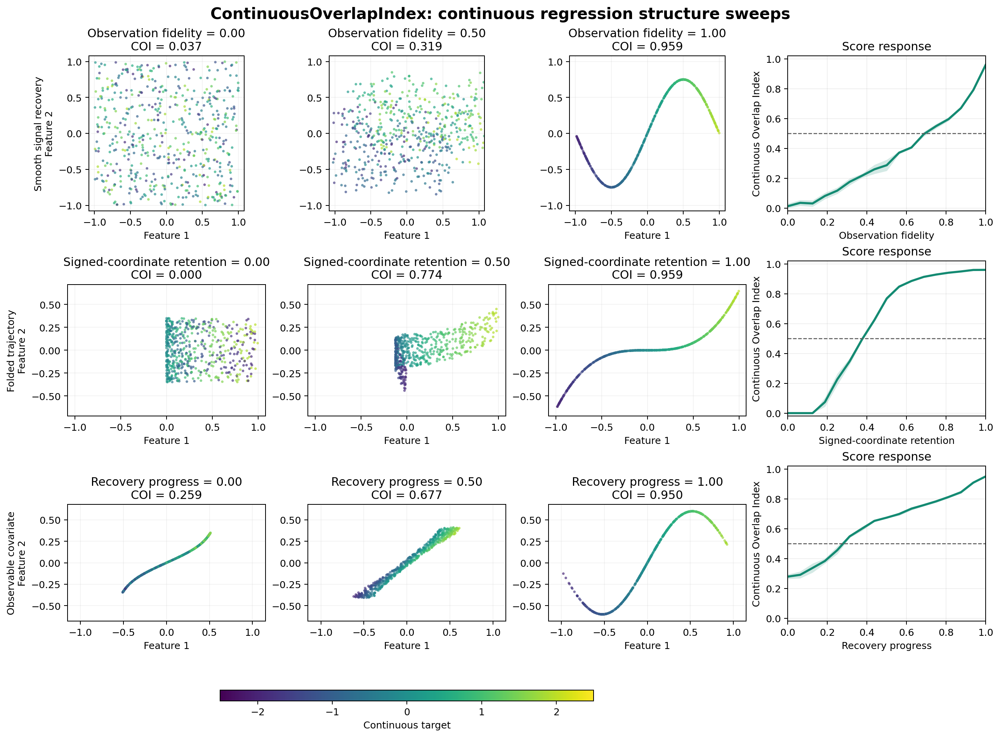
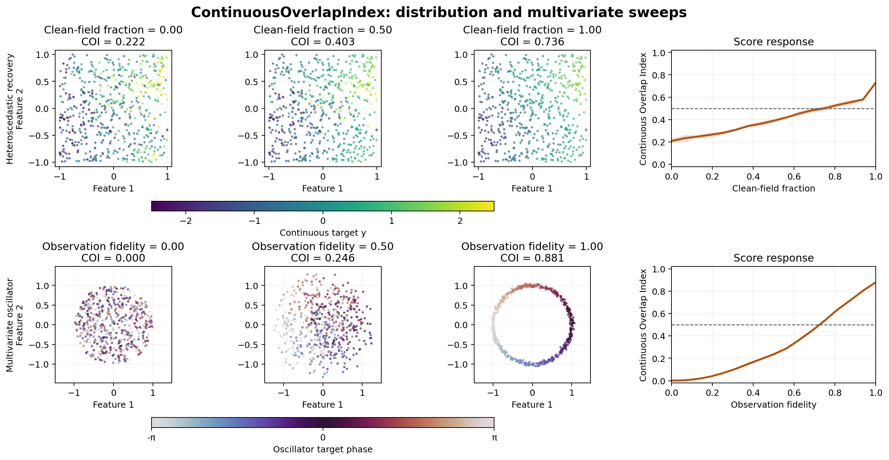

# Continuous targets

`ContinuousOverlapIndex` is the regression counterpart to the discrete-label
estimator. It asks whether nearby feature prototypes contain compatible
empirical target distributions, then calibrates the observed disagreement
against shuffled target assignments.

```python
from sklearn.preprocessing import MinMaxScaler
from overlapindex import ContinuousOverlapIndex

X = MinMaxScaler().fit_transform(X)

coi = ContinuousOverlapIndex(
    model_type="MiniBatchKMeans",
    kmeans_k=8,
    kmeans_kwargs={"random_state": 0},
    n_target_cells="auto",
    n_null_permutations=20,
    random_state=0,
).fit(X, y_regression)

print(coi.index)
print(coi.actual_loss_, coi.null_loss_)
```

The estimator is offline-first. MiniBatchKMeans, KMeans, and BallCover are
supported; `partial_fit` refits on the supplied batch and does not retain
continuous-target state across calls.

KMeans and MiniBatchKMeans also accept SciPy sparse feature matrices. Sparse
inputs remain in CSR form through prototype fitting, adjacency scoring, and
permutation-null refits; continuous targets remain dense numeric arrays.

`random_state` seeds target-cell construction, projection directions,
permutation sampling, and the selected feature backend. An explicit
`random_state` inside `kmeans_kwargs` or `ballcover_kwargs` takes precedence
for that backend.

## The fitting pipeline

1. Scale the continuous target columns according to `target_scaling`.
2. Partition target space into pseudo-label cells.
3. Fit label-owned feature prototypes using those cells.
4. Build prototype adjacency in feature space.
5. Measure disagreement between empirical target distributions on adjacent
   prototypes.
6. Compare actual loss with a permutation-null loss and aggregate local
   prototype indices.

The support-weighted calibration follows

$$
\text{index} = \operatorname{clip}\left(
1 - \frac{\text{actual loss}}{\text{null loss}},
0,
1
\right).
$$

Thus `1.0` represents no observed harmful overlap, values between `0.0` and
`1.0` represent partial separation, and `0.0` represents complete or
permutation-equivalent overlap. All reported local and aggregate values are
bounded to `[0, 1]`. A `loss_ratio_` above `1.0` identifies worse-than-null
disagreement while the index remains at the lower endpoint.

## Target cells and distances

| Target shape | `target_cover="auto"` | `target_distance="auto"` |
| --- | --- | --- |
| Univariate | Quantile cells | 1D Wasserstein distance |
| Multivariate | KMeans cells | Sliced Wasserstein distance |

`n_target_cells="auto"` resolves to a sample-size-dependent value between 8
and 64, capped by the number of samples. Too few cells can hide target
structure; too many may leave cells and their feature prototypes poorly
supported. For multivariate targets, set `random_state` and optionally
`target_cover_kwargs` for reproducible KMeans cells.

`target_scaling="standard"` is the default. The alternatives are `"none"`,
`"minmax"`, and `"robust"`. Scaling is particularly important when
multivariate target columns use different units.

## Feature adjacency

The default `adjacency_mode="soft_topk"` spreads each sample's competitor mass
over up to `top_k` nearby non-own prototypes. `feature_temperature` controls
the concentration: smaller values approach a single dominant competitor.

Use `adjacency_mode="hard_top1"` for strict single-competitor scoring or
backwards comparisons. Keep adjacency settings constant when comparing
representations.

## Continuous behavior gallery

The main synthetic gallery follows three genuinely continuous regression
problems: a smooth latent signal with increasing observation fidelity, a
folded latent trajectory that is progressively unfolded in feature space, and
a continuous covariate that is gradually recovered. It uses eight target
cells, rather than reducing each problem to a high-versus-low split, and
strict nearest-competitor adjacency so the ideal target-ordered endpoints
approach the `1.0` anchor.



Regenerate it from the repository root with:

```bash
poetry run python examples/visualize_continuous_overlap_sweeps.py
```

An additional gallery shows a heteroscedastic target field becoming cleaner
and a multivariate oscillator target observed with increasing fidelity:



```bash
poetry run python examples/visualize_continuous_overlap_additional_sweeps.py
```

The example scripts use six refit permutations per score to keep the complete
sweeps practical to reproduce. Increase `n_null_permutations` when adapting
them for final quantitative reporting.

## Permutation nulls

- `null_mode="refit_permutation"` rebuilds target cells and feature prototypes
  for every shuffle. It provides the strongest null semantics and is the best
  choice for final reporting when affordable.
- `null_mode="fixed_structure_permutation"` keeps fitted prototype geometry
  and shuffles targets across it. It is substantially faster but approximate.
- `null_mode="auto"` uses the refit mode when
  `n_samples * n_null_permutations < auto_null_work_threshold`, otherwise the
  fixed-structure mode. The default threshold is `100_000`.

Inspect `null_mode_` after fitting to see which mode actually ran. Increase
`n_null_permutations` for a more stable null estimate, trading off runtime.
`null_loss_samples_` contains the individual draws.

## Aggregation and diagnostics

`aggregation="support_weighted"` is the default, so `index` calibrates the
support-weighted prototype loss. With `aggregation="macro"`, `index` is the
unweighted mean of the bounded prototype indices and `macro_index_` contains
the same value. The `weighted_index` property is always available regardless
of the selected aggregation.

Useful fitted attributes include:

- `actual_loss_`, `null_loss_`, and `loss_ratio_` for calibration.
- `prototype_index_`, `prototype_loss_`, and `prototype_support_` for local
  diagnosis.
- `prototype_target_values_`, `prototype_target_mean_`, and
  `prototype_target_cov_` for target summaries.
- `prototype_adjacency_` and `prototype_adjacency_normalized_` for the feature
  neighborhood graph.
- `target_cell_ids_`, `target_cover_`, and `target_distance_` for resolved
  target-space choices.

The prototype target attributes retain empirical target measures rather than
reducing every prototype to only a mean or variance. This is what allows the
configured Wasserstein distance to compare richer local target distributions.

Continuous and discrete scores use related interpretation anchors but different
calibrations. Do not directly compare an OI from one estimator with a COI from
the other.

## Calibration migration

The continuous calibration changed in the `0.1.3` alpha series. At the
loss-ratio level, the new pre-bound calibration equals
`2 * legacy_score - 1`, after which values are bounded to `[0, 1]`. Historical
and recalibrated COI values should not be compared directly.
